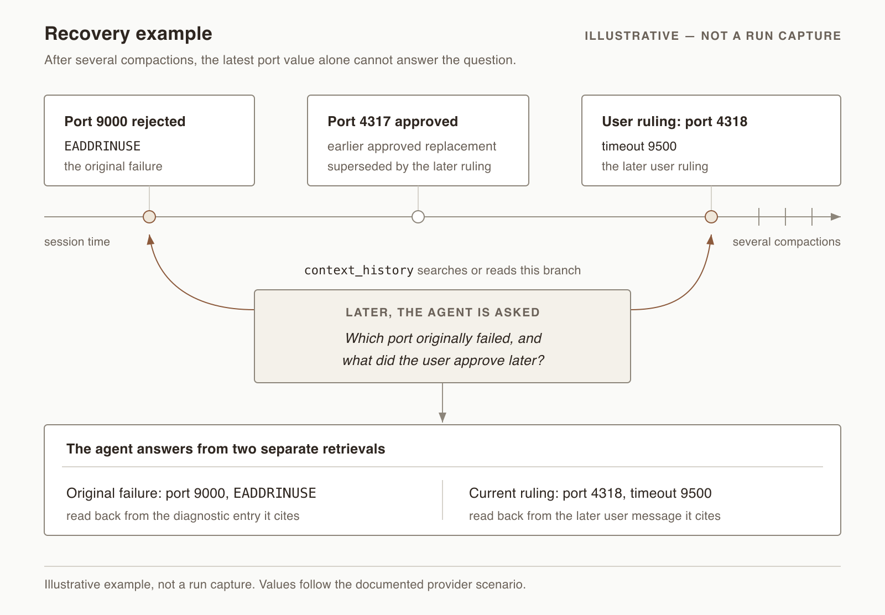

# Pi Context Compaction


**Compact the context, not the evidence.**

Source-linked context compaction for [Pi](https://github.com/earendil-works/pi). Each checkpoint carries a structured handover note with references to original session records. Source references and verbatim quotations are checked before commit. After compaction, the agent can use `context_history` to search and read earlier records on the current session branch.

A compaction note should carry the task forward and provide an index back to the original transcript.

**Status:** experimental source build based on Pi v0.86.0; latest release [v0.2.4](https://github.com/youxi-huang/pi-context-compaction/releases/tag/v0.2.4) is a pre-release. Includes required host changes; it cannot be added to stock Pi with `pi install`.

[Recovery example](#recovery-example) · [How it works](#how-it-works) · [Evidence and limits](#evidence-and-limits) · [Build and run](#build-and-run) · [Discussions](https://github.com/youxi-huang/pi-context-compaction/discussions)


## Recovery example

After several compactions, knowing the latest port is not enough to explain how it was chosen. An earlier failure and a later user ruling are different pieces of evidence.

> Which port originally failed, and what did the user approve later?

The example below follows the values in the [documented provider scenario](docs/context-memory/validation.md#real-provider-scenario): port **9000** was rejected after `EADDRINUSE`, **4317** was the earlier approved replacement, and **4318** with timeout **9500** came from a later user ruling. With `context_history`, the agent can retrieve the original diagnostic and the later instruction, keeping the two events distinct and citing their source entries.



*Illustrative diagrams, not run captures or benchmark results. The [validation record](docs/context-memory/validation.md) describes the actual runs and their limits.*

## How it works

Pi's native compaction retains session history on disk and rebuilds the model's active context from a summary and retained recent messages. This project adds source-linked handover notes, reference checks and a branch-scoped history tool to the continuation workflow.

1. **Write a handover.** The current session model writes the note by default; a fixed writer is optional. The note records task state, next steps and references to original entries.
2. **Check before committing.** Source references must belong to the selected branch, and quotations must occur verbatim in their cited records. Changed sources, invalid notes and failed writes prevent checkpoint publication. Failed compaction blocks further requests until explicit retry or new input; no other writer is silently substituted.
3. **Continue and check details.** The agent resumes from the handover and can search or read original records through `context_history`. Earlier-checkpoint anchors help locate phases that the newest note no longer describes.

These checks establish reference consistency, not semantic completeness or guaranteed model adherence. Original records can remain retrievable even when a note omits a detail; the agent still has to find and interpret the relevant evidence.

The scope is **task continuity across compaction**. History access follows the current session branch and explicit parent-history grants. General cross-session memory and user-preference storage are outside this design. This repository explores source-linked compaction in Pi; portability to other hosts is a future direction.

See the [architecture](docs/context-memory/architecture.md) for persistence, continuation protections and history authorization, and the [upstream delta](docs/context-memory/upstream-delta.md) for the six host files this distribution adapts.

## Evidence and limits

| Evidence | What it supports |
| --- | --- |
| **92 context-memory regressions** | Covered contracts for notes, budgets, sources, retrieval, persistence and failure handling. Synthetic checks; no model calls. |
| **456 host security and compatibility regressions** | Covered host behavior under synthetic inputs and mocked providers. Separate from recovery-quality evaluation. |
| **One passing nine-checkpoint live stress sequence** | A real model continued a synthetic task across nine automatic checkpoints and recovered earlier facts after session reopening. This followed one failed run and a correction. |
| **Recovery comparison against native Pi** | Not yet measured. Replayable fixtures and probe questions are planned for 0.3.0. |

The nine-checkpoint run used a 10k compaction trigger, not a 10k model window. Its compaction pause was **40.1 seconds at the median**, with pauses totaling **57.7% of elapsed time** and **25 history calls** across the run. This exposes real pause and retrieval costs; it is not a failure-rate estimate, a lossless-memory result or evidence that this method outperforms native Pi. The sequence was recorded during v0.2.2 development; v0.2.3 has separate budget and recovery checks.

The [validation record](docs/context-memory/validation.md) separates offline regressions, real-provider runs, failures and unmeasured cases. The [roadmap](docs/context-memory/roadmap.md) tracks recovery accuracy, compaction pause, token overhead and host footprint. Multi-day quality, near-window behavior and systematic provider comparisons remain unmeasured.

## Build and run

Requirements: Node.js 22.19 or newer, npm, Git, curl and tar. Persistent sessions currently support macOS and Linux.

```sh
git clone https://github.com/youxi-huang/pi-context-compaction.git
cd pi-context-compaction
git checkout v0.2.4
npm ci --ignore-scripts
node scripts/context-memory-model-data.mjs
node scripts/stamp-context-memory.mjs
npm run build:offline
node scripts/context-memory-check.mjs
```

The model-data helper downloads the pinned upstream source release, checks its SHA256 and extracts the public model catalog for the offline build. It does not read Pi configuration or call a model. The focused check runs static checks and context-memory regressions without provider calls, browser smoke checks or the full upstream suite.

Authenticate through Pi's normal login or API-key configuration, then start a fresh session:

```sh
node packages/coding-agent/dist/bundle/cli.js --no-extensions
```

`--no-extensions` disables ordinary extension discovery; the compaction extension is built into this host. Add trusted provider extensions explicitly with `-e` if your model needs one. This repository supplies no credentials and does not replace a global Pi installation or migrate old sessions automatically.

The **current session model writes the note by default**, so no second model configuration is required. Use `/compact` to compact manually and `/compaction-status` to inspect the writer, checkpoint, budget and request state. Full configuration, fixed-writer setup, event reporting and compactor compatibility are in [Configuration and operation](docs/context-memory/configuration.md).

## Status and compatibility

This is an independently maintained experimental Pi distribution, built from source. Its upstream baseline is Pi **v0.86.0** (`ecac0a9c`), imported as a clean snapshot. The extension and its required host changes ship together; ordinary extension packaging is the [1.0 goal](docs/context-memory/roadmap.md), not a current install option. The root `package.json` carries upstream workspace metadata and is not this project's version.

The latest tagged release, **v0.2.4**, ports the existing compaction behavior to Pi v0.86.0, preserving transcript prompt/tool changes and adopting the upstream cut-point fix. The [changelog](CHANGELOG.md) separates released changes from updates on `main`; the build instructions above use the release tag.

Notes, tool results and history can contain sensitive information. They remain in local session files, but relevant source content is sent to the writer during compaction and to the selected model when retrieved. History grants restrict this API; they are not an operating-system sandbox for agents with shell access.

Opaque checkpoints from older provider-specific compactors require a reviewed migration copy before resuming. Run `node scripts/context-memory-migrate.mjs --help` for the workflow. The script has no live session, so it needs a fixed `provider/model` writer in `pi-context-memory.json` for the run; with `"session"` it stops before any work. It cannot recover missing evidence or decrypt remote checkpoints.

v0.2.4 reads existing valid checkpoints without rewriting them and preserves Pi v0.86.0 transcript prompt/tool state through compaction and reopening. Custom providers must support Pi v0.86.0 normalized transcript inputs; update provider extensions before using them with this release. A provider still reading legacy `context.systemPrompt` or `context.tools` may silently omit instructions or tools.

The v0.2.3 note-budget behavior remains unchanged. New checkpoints carry a bounded budget decision so publication and reopening agree even above 6,000 estimated tokens; lowering generation settings does not invalidate stored notes. **Older binaries cannot read new notes above their 6,000-token limit.** Keep those sessions on v0.2.3 or newer; a binary rollback is not a session-format downgrade. A changed model still must fit the final recovery payload.

This release contains the host and compaction modules. Locally adapted BTW, subagent and provider packages are not bundled. Integrators can use the exported `contextMemory` API; unmodified third-party packages should not be assumed compatible. Windows persistence, long-running semantic quality and repeated incremental-note comparisons are not validated.

The project was initially named Pi Context Memory. Existing `context-memory` source paths, the `pi-context-memory.json` configuration file, the `contextMemory` API and stored checkpoint identifiers retain their original names. The project rename does not require configuration or session migration.

## License and acknowledgments

MIT. Pi retains its original license and copyright. New context-memory code is covered by the same license; see [THIRD_PARTY_NOTICES.md](THIRD_PARTY_NOTICES.md).

The design was inspired in part by OpenAI's public description of notes across context windows and retrieval of earlier task messages. Codex assisted development. This project is independently maintained and is not an official OpenAI or Pi release. No OpenAI context-management implementation has been copied. See [OpenAI's description](https://learn.chatgpt.com/docs/models).

The original Pi README is retained as [UPSTREAM_README.md](UPSTREAM_README.md). Its release and support instructions apply to upstream Pi, not this experimental distribution.
